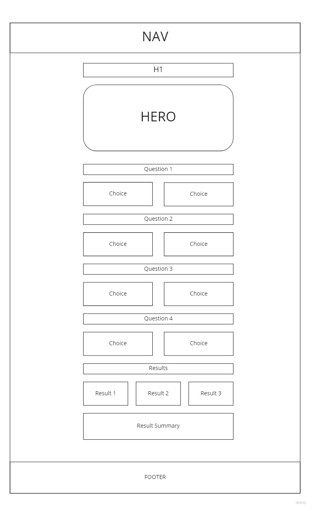
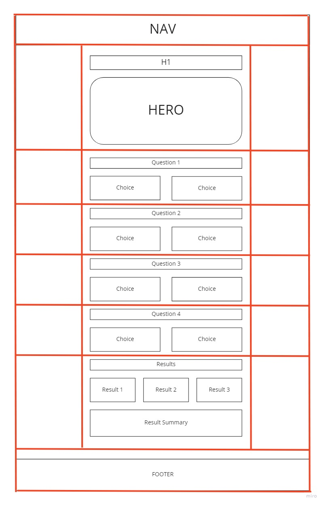
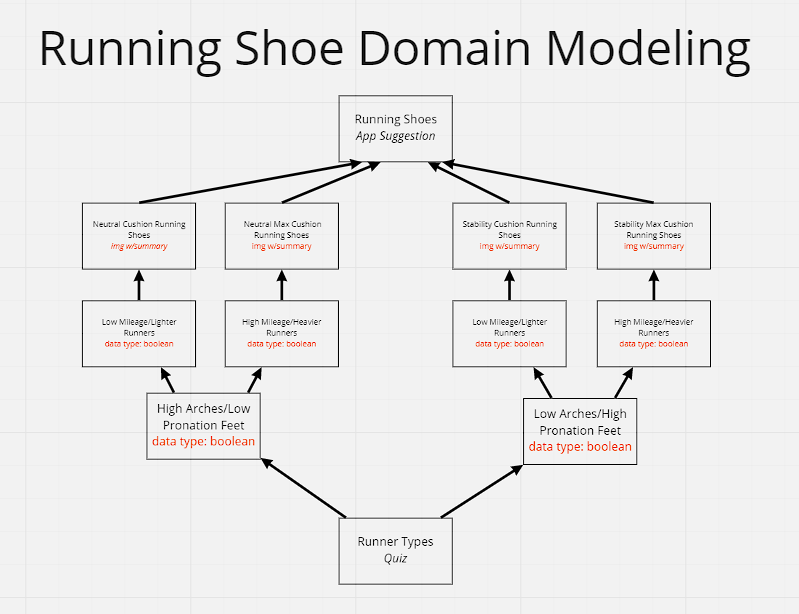

# running-shoe-guide

This application is designed to help users pick the perfect running shoe based on their responses specified in an interactive questionnaire. After they've received three suggestions from competing brands, users are able to read more about why that type of running shoe is right for them.

## Authors: Derek Douglas and Martha Quintanilla-Ramirez

Special thanks go to Zayah Lang for creating the shoe art we are using in product renders.

## Wireframes

The first wireframe is the basic structure of our quiz homepage.

This wireframe represents the CSS grid layout of the page.

## Domain Modeling

Here is a visualization of our domain modeling:

## User stories

Can be found in  our [requirements](requirements.md) page or [project list](PROJECT-LIST.md) pages.

### Links and Resources

- [CSS](https://www.bitdegree.org/learn/css-opacity#:~:text=Learn%20on%20Udacity-,Setting%20Transparent%20Boxes,to%20multiple%20elements.&text=Tip%3A%20you%20should%20notice%20that,to%20keep%20the%20text%20opacity)
- [Shoe Vector Art](https://www.vecteezy.com/free-vector/shoes)

### Reflections and Comments

- There are many different ways to handle the logic of a quiz in JavaScript. Because or quiz features sets of 2 answers for each question, we decided to use boolean as our data type to keep things simple and tidy.
